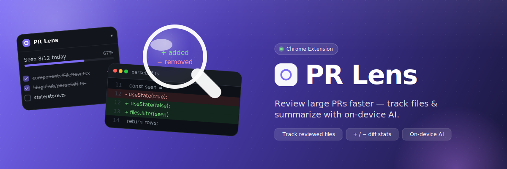

# PR Lens



A Chromium (Manifest V3) extension that makes large GitHub pull requests easier to review. It injects a file-tree review tracker into the "Files changed" page, remembers which files you have already looked at across reloads, and generates a PR summary with on-device AI — free, unlimited, and entirely local by default.

Korean: [README.ko.md](README.ko.md)

## What it does

Review tracking:
- File-tree panel — a floating list of every changed file with add/delete counts, pinned to the PR's Files changed page
- Seen checkboxes — a "Seen" checkbox on each file header and in the panel; state persists per PR across reloads and revisits
- Progress — "Seen N/M today" with a progress bar, so you always know how far you got
- Jump — click a file in the panel to scroll straight to its diff

AI summary:
- Four engines — pick the one that fits your machine and budget in Settings
- On-device by default — Chrome's built-in Prompt API (Gemini Nano): no key, no cost, no data leaving the machine
- Side panel — summary opens in Chrome's side panel: one-line takeaway, key changes, and review points
- Cached — a generated summary is stored per PR and reshown instantly on the next visit

Interface:
- Language toggle — switch the whole UI between English and Korean at the top of Settings; the choice applies live to the panel and side panel
- The summary content itself is always written in Korean, regardless of the UI language

## AI engines

Choose one in Settings → AI summary engine. All keys and settings stay in `chrome.storage.local`.

- Chrome built-in AI (default, no key) — runs Chrome's on-device model. Nothing leaves your machine. Requires Chrome 138+ with the built-in model available.
- WebLLM (no key · unlimited · local) — runs a model fully in your browser via WebGPU. The first use downloads the weights once and caches them; afterwards it works offline.
- Google Gemini (free key · no GPU) — reliable free cloud summaries using a free Google AI Studio key. No GPU required; your PR diff is sent to Google. Settings includes a step-by-step guide to get the key.
- Claude API (paid · key required) — highest-quality summaries using your own Anthropic key.

For Gemini and Claude you can type a model id or load the live model list from the provider with your key.

## How it works

A content script runs on `github.com`, detects PR Files-changed pages (including SPA navigations via a history hook + MutationObserver), and injects the tracker with scoped, prefixed styles so it never collides with GitHub's own DOM. DOM selectors live in a single module and degrade gracefully — if GitHub changes its markup, the panel reports "no changed files" instead of breaking the page.

The AI summary runs in the side panel. It fetches PR metadata and the changed-file diffs through the GitHub REST API (optionally with your PAT for private repos and higher rate limits), builds a prompt, and streams the result through the chosen engine: the browser's built-in `LanguageModel`, a local WebLLM model, Gemini (raw SSE), or the Claude API via the official SDK. Review state, settings, and cached summaries are kept in `chrome.storage.local`; nothing is sent anywhere except the GitHub and (opt-in) AI calls you trigger.

Project structure:
```
src/
  content/     PR page injection (file tree, seen checkboxes, SPA nav)
    selectors  GitHub DOM selectors, isolated for resilience
  sidepanel/   React side panel + AI orchestration (4 engines)
  options/     settings (language, AI engine, keys, models)
  background/  service worker (opens the side panel)
  core/        pure logic (prKey, storage, github, summary prompt, i18n)
```

## Permissions

- `storage` — review state, settings, cached summaries (local only)
- `sidePanel` — the summary panel
- host access to `github.com` and `api.github.com` — read PR diffs
- host access to `generativelanguage.googleapis.com` — only used when you opt into Gemini
- host access to `api.anthropic.com` — only used when you opt into Claude
- host access to `huggingface.co` and `raw.githubusercontent.com` — only used to download WebLLM model weights

## License

MIT. Author: Huido Choo.
